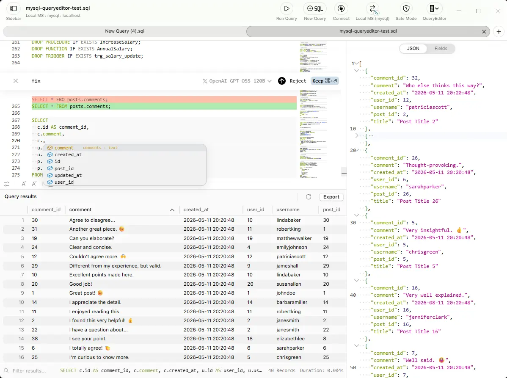

# QueryEditor

A desktop SQL editor that keeps your queries on your machine. Local-first, file-based workspace with Monaco editor and optional AI assistance.

<picture>
  <source media="(prefers-color-scheme: dark)" srcset="packages/shared/images/hero-dark.webp" />
  <source media="(prefers-color-scheme: light)" srcset="packages/shared/images/hero-light.webp" />
  
</picture>

## Links

- **Website:** [queryeditor.com](https://queryeditor.com)
- **Documentation:** [docs.queryeditor.com](https://docs.queryeditor.com)
- **X (Twitter):** [@queryeditor](https://x.com/queryeditor)

## License

- Desktop Application: Proprietary ([LICENSE](LICENSE))
- Website & Documentation: MIT ([apps/web/LICENSE](apps/web/LICENSE))
